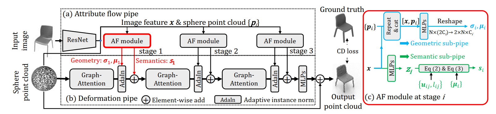

# 3D Shape Reconstruction from 2D Images with Disentangled Attribute Flow (CVPR22)

This repository contains the code for the paper.
[3D Shape Reconstruction from 2D Images with Disentangled Attribute Flow](https://arxiv.org/abs/2203.15190).

<p align="center", width="780" >
  
</p>

If you find our code or paper useful, please consider citing

    @inproceedings{3DAttriFlow,
        title = {3D Shape Reconstruction from 2D Images with Disentangled Attribute Flow},
        author = {Wen, Xin and Zhou, Junsheng and Liu, Yu-Shen and Su, Hua and Dong, Zhen and Han, Zhizhong},
        booktitle = {Proceedings of the IEEE/CVF Conference on Computer Vision and Pattern Recognition (CVPR)},
        year = {2022}
    }

## Installation:
Our code is implemented in Python 3.5, PyTorch 1.2 and CUDA 10.0.
- Install python Dependencies
```python
cd 3D-AttriFlow
pip install -r requirements.txt
```

- Compile PyTorch 3rd-party modules.
```python
cd utils/ChamferDistancePytorch/chamfer3D
python setup.py install
cd -
cd utils/Pointnet2.PyTorch/pointnet2
python setup.py install
cd -
cd utils/emd
python setup.py install
cd -
```

## Dataset:
Single View Reconstruction
- Download ShapeNet data from : https://drive.google.com/drive/folders/1If_-t0Aw9Zps-gj5ttgaMSTqRwYms9Ag?usp=sharing
- unzip ShapeNetV1PointCloud.zip and unzip ShapeNetV1Renderings.zip to your data path
- make cache folders:
```
mkdir cache
mkdir cache_test
```

- You need to update the file path of the datasets in `cfgs/SVR.yaml` line 63:
```
pointcloud_path: 'Path/ShapeNetV1PointCloud'
image_path: 'Path/ShapeNetV1Renderings'
cache_path: 'Path/cache'
cache_path: 'Path/cache_test'
```

Point Cloud Completion
- Download MVP data from : https://drive.google.com/drive/folders/1XxZ4M_dOB3_OG1J6PnpNvrGTie5X9Vk_
- You need to update the file path of the datasets in `dataset_pc/dataset.py`:
```
if prefix=="train":
    self.file_path = 'Path/MVP_Train_CP.h5'
elif prefix=="val":
    self.file_path = 'Path/MVP_Test_CP.h5'
```

## Checkpoints:
- You can download our checkpoints from: https://drive.google.com/drive/folders/1UXncXeE7L5p4h0Px8JI432g8l5uzgxMK?usp=sharing
- Put them in './checkpoints'

## Usage:
- To train a model: 
```python
python train_svr.py -c cfgs/SVR.yaml -gpu 0
or
python train_pc.py -c cfgs/PC.yaml -gpu 0
```
- To test a model:  
```python
python val_svr.py -c cfgs/SVR.yaml -gpu 0
or 
python val_pc.py -c cfgs/PC.yaml -gpu 0
```
## Acknowledgements

Some of the code of this repo is borrowed from [VRCNet](https://github.com/paul007pl/VRCNet), [EigenGAN-Pytorch](https://github.com/bryandlee/eigengan-pytorch), [pytorchpointnet++](https://github.com/erikwijmans/Pointnet2_PyTorch) and [ChamferDistancePytorch](https://github.com/ThibaultGROUEIX/ChamferDistancePytorch). We thank the authors for their great job!

## License

This project is open sourced under MIT license.
